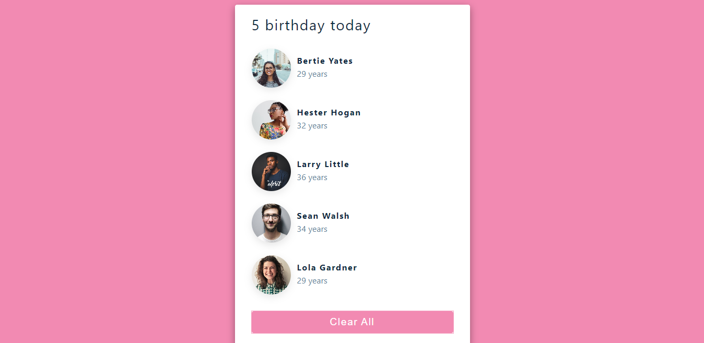

# Project:-  Birthday-Reminder

> This project consists of building an React app using hooks where data will be render from static file and data of users shown using jsx and with button fuctionality to update the state.

## Built With

- React
- HTML and CSS,
- Grid and Flex,
- UI and UX
- Media Query

<!-- ## Live Demo

[Live Demo Link](https://rawcdn.githack.com/hemant-soni-vst-au4/the-next-web/15aa1ccd66152fdb611afd39c11d8e4c4638cab1/index.html) -->

## Authors

👤 **Hemant soni**

- Github: [@hemant-soni-vst-au4](https://github.com/hemant-soni-vst-au4)
- Twitter: [@Hemants63203059](https://twitter.com/Hemants63203059)
- Linkedin: [linkedin](https://www.linkedin.com/in/hemant-soni-97427b193/)

## 🤝 Contributing

Contributions, issues and feature requests are welcome!

Feel free to check the [issues page]().

## Show your support

Give a ⭐️ if you like this project!

## Acknowledgments

- Hat tip to anyone whose code was used
- Inspiration
- etc

## 📝 License

This project is [MIT](lic.url) licensed.